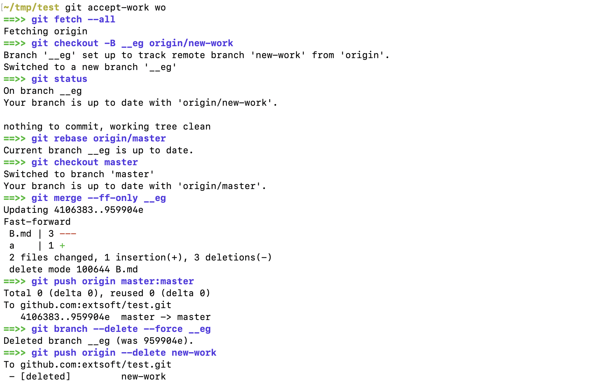

[sb]: https://img.shields.io/badge/Choose%20issue-simple-green
[sl]: https://github.com/bees-hive/elegant-git/issues?q=is%3Aissue+is%3Aopen+label%3A%22help+wanted%22+sort%3Acomments-desc+no%3Aassignee
[ab]: https://img.shields.io/badge/Choose%20issue-any-blue
[al]: https://github.com/bees-hive/elegant-git/issues?q=is%3Aissue+is%3Aopen+sort%3Areactions-%2B1-desc+no%3Aassignee
[cb]: https://img.shields.io/github/commits-since/bees-hive/elegant-git/latest?label=Commits%20for%20next%20release
[cl]: https://github.com/bees-hive/elegant-git/commits/master
[vb]: https://img.shields.io/github/v/tag/bees-hive/elegant-git?label=Last%20release
[vl]: https://github.com/bees-hive/elegant-git/releases/latest
[lb]: https://img.shields.io/github/license/bees-hive/elegant-git
[0b]: http://www.0pdd.com/svg?name=bees-hive/elegant-git
[0l]: http://www.0pdd.com/p?name=bees-hive/elegant-git
[bb]: https://travis-ci.org/bees-hive/elegant-git.svg?branch=master
[bl]: https://travis-ci.org/bees-hive/elegant-git
[db]: https://readthedocs.org/projects/elegant-git/badge/?version=latest
[dl]: https://elegant-git.bees-hive.org/en/latest/?badge=latest

# Elegant Git
Elegant Git is an assistant who carefully makes routine work with Git.

Please visit <https://elegant-git.bees-hive.org/> to get started with user documentation or
click on the picture :point_down::point_down::point_down: to see a demo.

[](http://www.youtube.com/watch?v=Py6bpwJw30I)

---

[![][vb]][vl] [![][cb]][cl]

[![][sb]][sl] [![][ab]][al]

[![][bb]][bl] [![][db]][dl] [![][0b]][0l]

[](http://www.rultor.com/p/bees-hive/elegant-git)

---

## The contribution process at a glance
1. Everyone contributing is governed by the [Code of Conduct](CODE_OF_CONDUCT.md) - please read it
2. After, please get familiar with project rules described in [CONTRIBUTING.md](CONTRIBUTING.md).
3. Make a contribution

:tada::tada::tada: That's all! :tada::tada::tada:

## Hands-on development notes
The information below guides you on different aspects of the development process. If you have
something which should be quickly available, please propose changes here.

**Table of contents**

- [Architecture](#architecture)
- [Coding rules](#coding-rules)
- [Debug mode](#debug-mode)
- [Testing procedure](#testing-procedure)
- [Unit testing](#unit-testing)
  - [Addons](#addons)
  - [Writing tests](#writing-tests)
  - [Assertions](#assertions)
  - [Test name template](#test-name-template)
- [Updating documentation](#updating-documentation)

### Architecture

The structure of directories:
```text
.
├── .workflows/    <- stores development scripts
├── bin/           <- stores executable which is entry point
├── completions/   <- stores completion files
├── docs/          <- stores user documentation
├── libexec/       <- contains all commands
├── tests/         <- stores all tests along with additional test libraries
└── workflows      <- executes different development tasks
```

When you run `git elegant ...`, it initiates `bin/git-elegant` entry-point script. It calls
`libexec/git-elegant` which is responsible for the execution of a given command by loading the code
of a desired command (using a command file like `libexec/git-elegant-<command>`) and executing
it. Each command file has to provide the following BASH functions:
- `command-name` prints a command name (line length is limited to 50 characters)
- `command-synopsis` prints a `usage` statement (line length is limited to 80 characters)
- `command-description` prints a command description (line length is limited to 80 characters)
- `default` executes given command

### Coding rules
We enforce having a consistent implementation by following the next strict rules:
- add `#!/usr/bin/env bash` at the beginning of each script
- use `git-verbose` instead of `git` if you need to print a `git`'s command to CLI
- a private function (a usage in the scope of current script) should be prefixed with `--`

If you need to write a message to the system output, please use public functions in
[libexec/plugins/text](libexec/plugins/text). All help messages have to use `cat`
for printing them.

### Debug mode
You can enable debug mode by running `export GED=1` (the equivalent of `set -x` for `bash`). 
Run `unset GED` to switch debug off. 

### Testing procedure
A testing procedure consists of 3 steps:
1. unit testing using [bats](https://github.com/sstephenson/bats)
2. installation testing
3. validation of documentation correctness
4. validation of todo' correctness (for [0pdd](http://www.0pdd.com/p?name=bees-hive/elegant-git))

All these steps can be executed by `./workflows ci` which runs a Docker container (based on
`beeshive/elegant-git-ci` image) and calls all described checks. The image is also used on CI.
If the image requires modifications, then

1. run `./workflows prepare-worker <new tag>` to build a new image
2. update `WORKER_IMAGE` in `./workflows` and test some workflow
3. run `./workflows publich-worker <new tag>`  to push the image

### Unit testing
#### Addons
In order to have a working unit tests, you need to add `load addons-common` line to each `.bats`
file. This addon configures right access to executables (`libexec` directory) and defines mandatory
functions.

Also, there are several optional addons which can be useful in some circumstances:
- add `load addons-repo` to interact with real git repository
- add `load addons-fake` to fake a Linux command
- add `load addons-cd`   to fake `cd` command
- add `load addons-read` to fake `read` command

#### Writing tests
1. **Use `setup()` or `teardown()`** bats methods only in the tests.
2. Use **`check` instead of bats `run`** to execute a command to be tested.
3. Use **`testtee`** to execute any real command within a test which should not be tested.
4. If `addons-fake` or `addons-repo` is used, call `fake-clean` or `repo-clean` within a `teardown()` method.
5. Do not fake `git-elegant` commands within the tests.

#### Assertions
- `[[ "${lines[0]}" = "+ the space " ]]` for an output line (index starts from 0)
- `[[ "$status" -eq 2 ]]` for a command status
- `[[ "${#lines[@]}" -eq 0 ]]` for a length of command output
- `[[ "${lines[@]}" =~ "exact string" ]]` for an output line within whole output

#### Test name template
Use the following test name template - `'<command args>': <describe what will be tested>` like
`'clone-repository': raise an error if cloneable URL isn't set`.

### Updating documentation
In order to get the documentation preview locally, please install required dependencies with 
`pip install -r docs/requirements.txt`. After, run `mkdocs serve` and open <http://127.0.0.1:8000/> 
in a browser. That's it!

The [docs/commands.md](docs/commands.md) generates by running `./workflows documentation` script.
All other files in ["docs" directory](docs/) require manual corrections.
